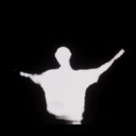

# 🌍 404 : Home

<p align="center">
  
</p>

<p align="center">
  <strong>A breathtaking 3D WebGL experience featuring an immersive, interactive environment.</strong>
</p>

<p align="center">
  <a href="#features">Features</a> •
  <a href="#screenshots">Screenshots</a> •
  <a href="#technologies">Technologies</a> •
  <a href="#running-locally">Running Locally</a> •
  <a href="#author">Author</a>
</p>

---

## ✨ Overview

**404 : Home** is an interactive WebGL project by creative technologist **Sunil**, and it's actually a sequel to his earlier work called *Drift*. 

### 📖 The Story
The story goes: an astronaut was lost in space in *Drift*, drifting and longing to return home. Now in *404 : Home*, he's landed on a new planet — it looks like Earth (grass, sky, ground) but feels wrong and "false." The grass never ends. Cosmic beams fall from the sky. Flowers bloom and die in seconds. He made it somewhere... but it's not home.

By combining advanced WebGL rendering, custom shaders, and spatial audio, it creates an atmospheric and cinematic journey directly in your browser to bring this narrative to life. 

<p align="center">
  
</p>

## 🚀 Features

- **Interactive 3D Elements:** High-fidelity 3D models with smooth, real-time controls.
- **Immersive Spatial Audio:** Atmospheric sound design that reacts dynamically to the environment.
- **Custom Shaders & VAT:** Utilizes Vertex Animation Textures (VAT) for seamless, highly performant 3D animations.
- **Dynamic Lighting & Textures:** Uses high-resolution PBR (Physically Based Rendering) textures and detailed environment maps.
- **Responsive Design:** Beautifully adapts to both desktop and mobile displays.

## 📸 Screenshots

Explore the visual fidelity of the project below:

<p align="center">
  
  
</p>
<p align="center">
  
  
</p>
<p align="center">
  
</p>

## 🛠️ Technologies

- **HTML5 / CSS3** for structure and styling.
- **JavaScript (ES6+)** for core logic.
- **WebGL / Three.js** for 3D rendering and scene management.

## 💻 Running Locally

To run this project on your local machine:

1. **Clone the repository:**
   ```bash
   git clone https://github.com/Sunil56224972/404-Home.git
   ```

2. **Navigate to the directory:**
   ```bash
   cd 404-Home
   ```

3. **Start a local development server:**
   You can use `npx serve` or any other local server.
   ```bash
   npx serve .
   ```
   *The server will start on `http://localhost:3000` by default.*

## 🧑‍💻 Author

**Sunil56224972**  
[GitHub Profile](https://github.com/Sunil56224972)

---
<p align="center">
  <i>If you enjoy this project, consider giving it a ⭐ on GitHub!</i>
</p>
